# 🏢 Lead Generation Department — SOP Process

> **Standard Operating Procedures** for Prospecting, Outreach, Lead Qualification, and Reporting.
> This document contains **13 SOPs** across **4 pillars** with visual process diagrams.

---

## 📋 Master SOP Overview

```mermaid
graph TB
    ROOT["🏢 Lead Generation Department\n13 SOPs across 4 Pillars"]

    ROOT --> P["🔍 PROSPECTING &\nRESEARCH"]
    ROOT --> O["📣 OUTREACH\nPROCESS"]
    ROOT --> Q["✅ LEAD\nQUALIFICATION"]
    ROOT --> D["📊 DATA &\nREPORTING"]

    P --> P1["SOP 1\nIdentify Target\nMarket Segments"]
    P --> P2["SOP 2\nResearch Prospects\n& Build Lists"]
    P --> P3["SOP 3\nUse Lead Gen Tools\nApollo / Zoho / WATI"]
    P --> P4["SOP 4\nData Entry &\nCRM Updates"]

    O --> O1["SOP 1\nCold Email\nTemplates & Cadences"]
    O --> O2["SOP 2\nCold Calling\nScripts & Guidelines"]
    O --> O3["SOP 3\nHandling\nInbound Leads"]

    Q --> Q1["SOP 1\nLead Scoring\nCriteria 0–10"]
    Q --> Q2["SOP 2\nBANT + Internal\nValidation"]
    Q --> Q3["SOP 3\nHandover Qualified\nLeads to Sales"]

    D --> D1["SOP 1\nDaily / Weekly\nReporting"]
    D --> D2["SOP 2\nManage DNC /\nDNE Lists"]
    D --> D3["SOP 3\nGDPR & Data\nPrivacy Compliance"]

    style ROOT fill:#1e293b,stroke:#334155,color:#fff,stroke-width:2px
    style P fill:#3b82f6,stroke:#1d4ed8,color:#fff,stroke-width:2px
    style O fill:#f97316,stroke:#c2410c,color:#fff,stroke-width:2px
    style Q fill:#22c55e,stroke:#15803d,color:#fff,stroke-width:2px
    style D fill:#8b5cf6,stroke:#6d28d9,color:#fff,stroke-width:2px

    style P1 fill:#eff6ff,stroke:#93c5fd,color:#1e40af
    style P2 fill:#eff6ff,stroke:#93c5fd,color:#1e40af
    style P3 fill:#eff6ff,stroke:#93c5fd,color:#1e40af
    style P4 fill:#eff6ff,stroke:#93c5fd,color:#1e40af

    style O1 fill:#fff7ed,stroke:#fdba74,color:#9a3412
    style O2 fill:#fff7ed,stroke:#fdba74,color:#9a3412
    style O3 fill:#fff7ed,stroke:#fdba74,color:#9a3412

    style Q1 fill:#f0fdf4,stroke:#86efac,color:#166534
    style Q2 fill:#f0fdf4,stroke:#86efac,color:#166534
    style Q3 fill:#f0fdf4,stroke:#86efac,color:#166534

    style D1 fill:#f5f3ff,stroke:#c4b5fd,color:#5b21b6
    style D2 fill:#f5f3ff,stroke:#c4b5fd,color:#5b21b6
    style D3 fill:#f5f3ff,stroke:#c4b5fd,color:#5b21b6
```

---

## 🔄 End-to-End Lead Lifecycle

> How a lead moves through the entire system — from identification to sales handover or retargeting.

```mermaid
graph LR
    A["🎯 Define ICP &\nTarget Market"] --> B["🔍 Research Prospects\nApollo + Dorking"]
    B --> C["📋 Build & Clean\nProspect List"]
    C --> D["📧 Cold Email\nDay 1 → Day 3 → Day 7"]
    D --> E{"Email\nEngaged?"}
    E -->|Opened/Clicked| F["💬 WhatsApp\nFollow-Up via WATI"]
    E -->|No Response| D2["📧 Continue\nEmail Nurture"]
    F --> G["📞 Cold / Warm\nCall"]
    G --> H["⭐ Lead Scoring\n0–10"]
    H --> I{"Score?"}
    I -->|"0–3 Cold"| J["🔵 Low Priority\nKeep in Nurture"]
    I -->|"4–6 Warm"| K["🟠 BANT\nQualification"]
    I -->|"7–10 Hot"| K
    K --> L{"Qualified?"}
    L -->|"Yes ✅"| M["🗂️ Enter CRM\nFlowaura"]
    L -->|"No ❌"| N["🔄 Retarget\nFuture Follow-Up"]
    M --> O["👤 Assign\nSales Rep"]
    O --> P["📅 Schedule\nDemo / Pitch"]
    P --> Q["🤝 Sales\nHandover"]

    style A fill:#eff6ff,stroke:#3b82f6,color:#1e40af
    style B fill:#eff6ff,stroke:#3b82f6,color:#1e40af
    style C fill:#eff6ff,stroke:#3b82f6,color:#1e40af
    style D fill:#fff7ed,stroke:#f97316,color:#9a3412
    style D2 fill:#fff7ed,stroke:#f97316,color:#9a3412
    style F fill:#fff7ed,stroke:#f97316,color:#9a3412
    style G fill:#fff7ed,stroke:#f97316,color:#9a3412
    style H fill:#f0fdf4,stroke:#22c55e,color:#166534
    style J fill:#dbeafe,stroke:#3b82f6,color:#1e40af
    style K fill:#f0fdf4,stroke:#22c55e,color:#166534
    style M fill:#f5f3ff,stroke:#8b5cf6,color:#5b21b6
    style N fill:#fef9c3,stroke:#eab308,color:#854d0e
    style O fill:#f5f3ff,stroke:#8b5cf6,color:#5b21b6
    style P fill:#f5f3ff,stroke:#8b5cf6,color:#5b21b6
    style Q fill:#dcfce7,stroke:#22c55e,color:#166534,stroke-width:3px
```

---

## 🔍 Pillar 1 — Prospecting & Research

### SOP 1: Identifying Target Market Segments

**Objective:** Define which businesses to target based on type (SMB, MSME, Startup) and region.

| Step | Action | Details |
|------|--------|---------|
| 1 | Analyze Existing Customers | Review paying customers & trial users. Identify patterns in industry, size, region, pain points. |
| 2 | Segment by Business Type | **Startups** (Tech-first, early-stage) · **MSMEs** (Cost-sensitive, regional) · **SMBs** (Stable, cloud scale) · **Enterprise** (Large corporations) |
| 3 | Apply Regional Filters | **Metro:** Delhi NCR, Mumbai, Bangalore · **Tier 2/3:** Jaipur, Indore, Lucknow |
| 4 | Document the ICP | Industry type, team size, tech stack, location, common use cases |
| 5 | Share with Team | Update master data sheet doc and communicate |

### SOP 2: Researching Prospects & Building Lists

**Objective:** Use tools and manual techniques to compile accurate prospect data.

| Step | Action | Details |
|------|--------|---------|
| 1 | Apollo.io Extraction | Apply filters (designation, industry, size, geography). Export verified emails. |
| 2 | Google Dorking | `"founder" + "startup" + "Mumbai" + "contact"` — collect names, LinkedIn, domains, emails |
| 3 | Compile Data | Google Sheet / Flowaura — Columns: Name, Company, Designation, Email, Phone, Region, Source, Status |
| 4 | Data Cleanup | Highlight incomplete/invalid entries. Cross-check & enrich. |

### SOP 3: Using Lead Gen Tools (Apollo.io, Zoho, WATI)

**Objective:** Use automation tools to improve outreach quality and response rates.

```mermaid
graph TD
    C1["Apollo.io\nExtract → Validate →\nEmail Sequences\nDay 1, 3, 7"]
    C2["Zoho Marketing Plus\nUpload → Segment →\nDesign Templates →\nCold + Nurture Workflows"]
    C3["WATI WhatsApp\nImport Engaged Users →\nFollow-up Templates →\nMonitor Status"]
    C1 --> C4["Integration Check\nClean Tracking\nNo Duplicates"]
    C2 --> C4
    C3 --> C4

    style C1 fill:#eff6ff,stroke:#3b82f6,color:#1e40af
    style C2 fill:#eff6ff,stroke:#3b82f6,color:#1e40af
    style C3 fill:#eff6ff,stroke:#3b82f6,color:#1e40af
    style C4 fill:#dcfce7,stroke:#22c55e,color:#166534
```

### SOP 4: Data Entry & CRM Updates

**Objective:** Track every lead's journey from first outreach to sales handover.

```mermaid
graph TD
    D1["📧 Email Sent\nZoho + Apollo"] --> D2["💬 WhatsApp Follow-Up\nBased on Open/Click"]
    D2 --> D3["📞 First Call\nCold / Warm\nUse Script + Checklist"]
    D3 --> D4{"Outcome?"}
    D4 -->|Meeting Booked| D5["✅ Tag: Meeting Booked\nEnter in CRM Flowaura\nAssign Sales Rep"]
    D4 -->|Not Interested| D6["❌ Tag: Not Interested"]
    D4 -->|Contact Later| D7["🔄 Tag: Future Follow-Up"]

    style D5 fill:#dcfce7,stroke:#22c55e,color:#166534
    style D6 fill:#fee2e2,stroke:#ef4444,color:#991b1b
    style D7 fill:#fef9c3,stroke:#eab308,color:#854d0e
```

---

## 📣 Pillar 2 — Outreach Process

### SOP 1: Cold Emailing Templates & Cadences

**Objective:** Run structured cold email campaigns with clear cadence logic.

### SOP 2: Cold Calling Scripts & Guidelines

**Objective:** Use standardized scripts and qualification guidelines for effective calls.

```mermaid
graph TD
    F1["Step 1: Use Approved Script\nIntroduction → Value Prop →\nIs this a good time? →\n2–3 Qualifying Questions"]
    F1 --> F2["Step 2: Listen & Log\nPain points, objections,\ncurrent platform,\ndecision-maker status"]
    F2 --> F3["Step 3: Validate Lead\nUse Lead Validation SOP"]
    F3 --> F4{"Step 4: Outcome?"}
    F4 -->|Interested| F5["✅ Book Meeting\nUpdate CRM\nNotify Sales"]
    F4 -->|Not Interested| F6["❌ Mark: Do Not Contact"]
    F4 -->|Unsure| F7["🔄 Set Reminder\nFollow Up Later"]

    style F1 fill:#fff7ed,stroke:#f97316,color:#9a3412
    style F2 fill:#fff7ed,stroke:#f97316,color:#9a3412
    style F3 fill:#fff7ed,stroke:#f97316,color:#9a3412
    style F5 fill:#dcfce7,stroke:#22c55e,color:#166534
    style F6 fill:#fee2e2,stroke:#ef4444,color:#991b1b
    style F7 fill:#fef9c3,stroke:#eab308,color:#854d0e
```

### SOP 3: Handling Inbound Leads

**Objective:** Validate inbound leads from signup, ads, or offers and hand over to sales.

---

## ✅ Pillar 3 — Lead Qualification

### SOP 1: Lead Scoring Criteria

**Objective:** Evaluate and prioritize leads based on engagement, intent, and fit.

| Scoring Factor | What to Check |
|----------------|---------------|
| 📧 Email Engagement | Opened, Clicked, Replied |
| 💬 WhatsApp / Call Response | Responded or not |
| 🏢 Company Size & Industry | Fit with ICP |
| 🎯 Use Case Relevance | Kubernetes, Storage, Compute-heavy |
| ⚡ Tech-readiness & Urgency | Immediate need or exploring |

```mermaid
graph LR
    H1["Assign Score\n0–10"] --> H2{"Classify Lead"}
    H2 -->|"0 – 3"| H3["🔵 COLD\nLow Priority"]
    H2 -->|"4 – 6"| H4["🟠 WARM\nNeeds Nurturing"]
    H2 -->|"7 – 10"| H5["🔴 HOT\nPriority Follow-up"]

    style H3 fill:#dbeafe,stroke:#3b82f6,color:#1e40af
    style H4 fill:#ffedd5,stroke:#f97316,color:#9a3412
    style H5 fill:#fee2e2,stroke:#ef4444,color:#991b1b
```

### SOP 2: Qualifying Leads (BANT + Internal Validation)

**Objective:** Confirm if a lead has real need, intent, and capacity to purchase.

```mermaid
graph TD
    I1["Apply BANT During Call"]
    I1 --> I1a["💰 Budget\nHave budget or free only?"]
    I1 --> I1b["👤 Authority\nDecision-maker or influencer?"]
    I1 --> I1c["🎯 Need\nUrgent pain point we solve?"]
    I1 --> I1d["📅 Timeline\nWhen planning to buy/migrate?"]
    I1a --> I2["Internal Validation\n₹500 balance added?\nVerified email/domain?\nReal use case mentioned?"]
    I1b --> I2
    I1c --> I2
    I1d --> I2
    I2 --> I3{"Qualification\nDecision"}
    I3 -->|"BANT + Validation ✅"| I4["✅ Mark: Qualified"]
    I3 -->|"Not Ready"| I5["🔄 Mark: Retargeting\nFuture Follow-Up"]

    style I1 fill:#f0fdf4,stroke:#22c55e,color:#166534
    style I4 fill:#dcfce7,stroke:#22c55e,color:#166534
    style I5 fill:#fef9c3,stroke:#eab308,color:#854d0e
```

### SOP 3: Handing Over Qualified Leads to Sales

**Objective:** Transfer qualified leads to sales with complete context and tracking.

---

## 📊 Pillar 4 — Data & Reporting

### SOP 1: Daily / Weekly Reporting

**Objective:** Track team performance, lead quality, and outcomes.

| Cadence | Who | What |
|---------|-----|------|
| **Daily** | Each Team Member | Calls made, Connections, Meetings booked, Requirements captured, Brand size |
| **Daily** | Each Team Member | Fill Individual KPI Sheet (prospect names, status, notes, source) |
| **Weekly** | Team Lead / Manager | Consolidated Report — performance trends, gaps, next week's plan |

### SOP 2: Managing DNC / DNE Lists

**Objective:** Avoid contacting leads who have opted out.

```mermaid
graph TD
    M1{"Lead says\nNot Interested?"}
    M1 -->|Yes| M2["Remove from\nMaster Calling Sheet"]
    M2 --> M3["Apollo: Mark as\nDo Not Contact"]
    M3 --> M4["Zoho: Move to\nSuppression List"]
    M4 --> M5["Update Central\nDNC/DNE List\nWeekly"]
    M5 --> M6["✅ Check DNC List\nBefore Every Campaign"]

    style M2 fill:#fee2e2,stroke:#ef4444,color:#991b1b
    style M3 fill:#fee2e2,stroke:#ef4444,color:#991b1b
    style M4 fill:#fee2e2,stroke:#ef4444,color:#991b1b
    style M6 fill:#dcfce7,stroke:#22c55e,color:#166534
```

### SOP 3: GDPR & Data Privacy Compliance

**Objective:** Ensure all lead generation activities respect user privacy.

| Step | Action | Details |
|------|--------|---------|
| 1 | Data Source Transparency | Use only public/verified sources (Apollo, LinkedIn, Company Sites). Avoid DOB, PAN, etc. |
| 2 | Consent in Email Campaigns | Include opt-out/unsubscribe. No misleading subject lines. |
| 3 | Lead Requests Removal | Delete data from **ALL** systems. Confirm if required. |
| 4 | Store Only Business Data | ✅ Name, Company, Email, Phone, Region · ❌ DOB, PAN, Financial Info |
| 5 | Train the Team | Monthly reminders on data protection |

---

## 🛠️ Tools Ecosystem & Integration

> How Apollo.io, Zoho, WATI, Flowaura, Google Sheets, and Slack interconnect.

---

## 📌 Lead Outcome Summary

| Outcome | Action | CRM Status |
|---------|--------|------------|
| ✅ Meeting Booked | Enter in CRM, Assign Sales Rep, Schedule Demo | `Meeting Booked` |
| ❌ Not Interested | Add to DNC/DNE list, Remove from campaigns | `Do Not Contact` |
| 🟡 Contact Later | Set reminder, Keep in nurture sequence | `Future Follow-Up` |
| 🟣 Not Ready (Post-BANT) | Move to retarget list, Add follow-up date | `Retargeting` |

---

> **Lead Generation Department** · Internal SOP Reference · Updated Feb 2026
